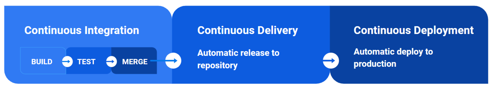

### Quy trình phát triển phần mềm
Để bắt đầu thì mình xin nói qua một chút về quy trình phát triển phần mềm và tại sao nó liên quan tới cicd
1. Các quy trình phổ biến
- thác nước
- các quy trình theo Agile: scrum, Feature-dev-driven
- hibrid

2. trong đó các phương pháp agile được rất nhiều tổ chức sử dụng vì tính chất của nó: phản hồi nhanh từ khách hàng, thay đổi linh hoạt, thích nghi, phát hiện lỗi sớm.
Agile yêu cầu việc phát triển phần mềm theo các vòng lặp ngắn (iterations/sprints).
Để thực hiện được điều này, developer phải tích hợp code, testing, triển khai với tần suất rất lớn.

Những việc lặp đi lặp lại như vậy khá nhàm chán và tốn thời giam. vì vậy để tự động hóa quy trình này chúng ta cần phải sử dụng cicd.

### CI/CD

Là phương pháp giúp tự động hóa các giai đoạn phát triển phần mềm: test, build, release và deploy 
và 
Giảm lỗi thủ công trong các qua trình trên.

1. Continuous Integration
Liên tục tích hợp, trong agile, việc commit code có tần suất cao, Sử dụng CI giúp cho việc run hàng loạt test trở nên tự động mỗi lần có commit, giúp tiết kiệm rất nhiều thời gian thay cho việc test thủ công

2. Continuous Delivery/Deployment
Sau khi CI hoàn thành và không có lỗi CD có thể tự động build, release bản build tới repository, và đưa vào môi trường production (hoặc là môi trường test)

### Các công cụ
github actions: Phổ biến với các dự án trên GitHub, mới phát triển trong những năm gần đây
gitlab và jenkins: được nhiều tổ chức sử dụng vì mã nguồn mở
CircleCI: tiện lợi khi solution sử dụng các dịch vụ cloud

Hoặc các bạn có thể từ server vật lý của mình, lắng nghe các thay đổi từ source code reposity và thực hiện flow được định nghĩa sẵn

### github actions
Github Actions là một tính năng của Github, nó cung cấp khả năng triển khai CI/CD có sẵn.
- Tính năng chính của github actions đó là triển khai các workflow dựa trên nhưng sự kiện được chỉ định.

Các workflow thường là việc run test, release, deploy.
Các workflow sẽ được chạy trên các runner là các máy chủ của github actions

Để định nghĩa workflow, cần tạo thư mục .github/workflows/ trong repository. Tạo các file .yml để định nghĩa workflow

các workflow trong yml sẽ được chạy song song hoặc tuần tự trên các runner của github acitons

Ở đây, là đồ án hiện tại của môn lập trình web nâng cao của mình, trong workflow mình có 2 work flow là test và deploy lên máy ảo

và có thêm 1 workflow nữa từ vercel để automate deploy UI

Hiện tại ứng dụng này không thể đăng nhập.
sau khi thêm chức năng đăng nhập ở branch auth-feature. giả sử developer test ở local thấy ok và commit lên branch, sau đó developer sẽ tạo pull request, lúc này workflow test đc triggered và chạy.

sau khi chạy xong, nếu có lỗi nó sẽ báo như này.

và developer sẽ phải sửa lại code
mình sẽ xóa các test để giả lập việc developer đã code đúng
và pull requsest lại,
Nói qua về flow test.
sau khi chạy test xong, lúc này nó sẽ báo oke, có thể merge

admin hoặc người có quyền, sẽ merge code vào production branch để deploy.

ở đây mình sẽ deploy lên máy ảo. 